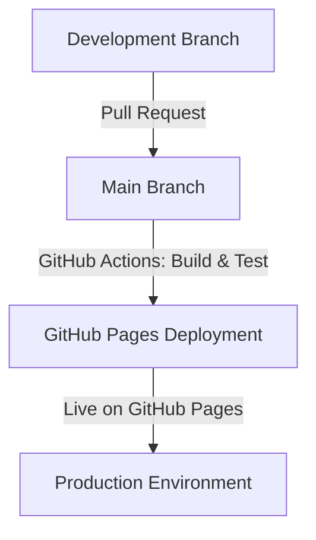

# Welcome to YOGAMOS

YOGAMOS is a modern web application built with Nuxt.js, designed to provide a seamless development experience with powerful tools and features.

## Features

- **Nuxt 3**: Leverage the power of the latest Nuxt framework for server-side rendering and static site generation.
- **NuxtUI 3**: Build beautiful and responsive user interfaces with NuxtUI components.
- **Nuxt Content 3**: Manage your content with ease using the Nuxt Content module.
- **Vitest**: Write and run fast, reliable tests for your application.
- **GitHub Pages Deployment**: Seamlessly deploy your application to GitHub Pages with a structured branch strategy.

Look at the [Nuxt documentation](https://nuxt.com/docs/getting-started/introduction) to learn more.

## Setup

Make sure to install dependencies:

```bash
# npm
npm install

# pnpm
pnpm install

# yarn
yarn install

# bun
bun install
```

## Development Server

Start the development server on `http://localhost:3000`:

```bash
# npm
npm run dev

# pnpm
pnpm dev

# yarn
yarn dev

# bun
bun run dev
```

## Production

Build the application for production:

```bash
# npm
npm run build

# pnpm
pnpm build

# yarn
yarn build

# bun
bun run build
```

Locally preview production build:

```bash
# npm
npm run preview

# pnpm
pnpm preview

# yarn
yarn preview

# bun
bun run preview
```

Check out the [deployment documentation](https://nuxt.com/docs/getting-started/deployment) for more information.

## Deployment Process



1. **Development:** Work on the `dev` branch.
2. **Pull Request:** Merge changes into `main` via PRs.
3. **GitHub Actions:** Runs build, tests, and checks.
4. **Deployment:** If successful, deploys to GitHub Pages.

## Testing

### Running Tests

Make sure you have installed Vitest:

```bash
npm install -D vitest @vue/test-utils jsdom
```

Run tests using:

```bash
npm run test        # Run all tests
npm run test:watch  # Run tests in watch mode
npm run test:ui     # Open Vitest UI
```

### Testing Overview

- **Unit Tests**: Ensures components function correctly.
- **Integration Tests**: Validates interactions between components.
- **SEO Tests**: Checks meta tags.
- **Error Handling**: Ensures proper error responses.

## TOOLS

### Nuxt Dev Tools

Nuxt DevTools is enabled by default in Nuxt v3.8.0. You can press Shift + Alt / ⇧ Shift + ⌥ Option + D in your app to open it up.

### ESLint Inspector

https://github.com/eslint/config-inspector

```bash
# Go to the project root that contains eslint.config.js and run:
npx @eslint/config-inspector@latest
```

Visit http://localhost:7777/ to view and play with your ESLint config. Changes to the config file will be updated automatically.
