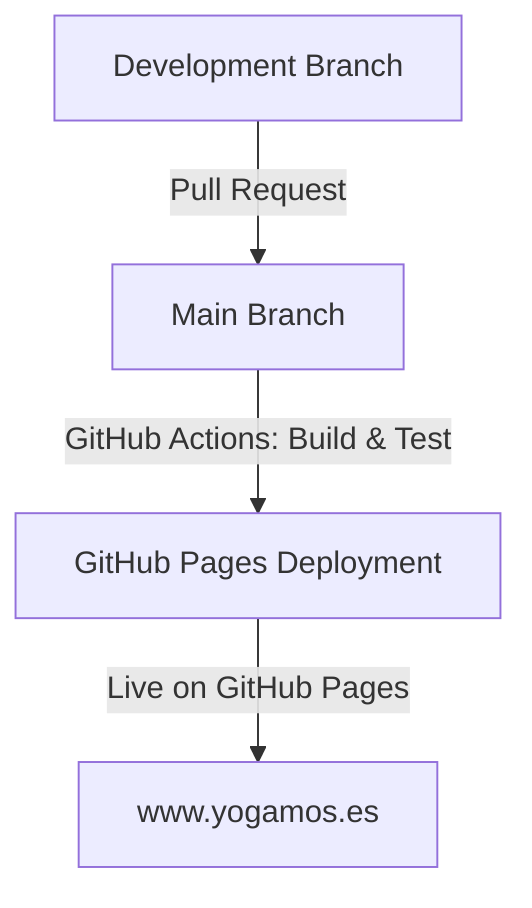
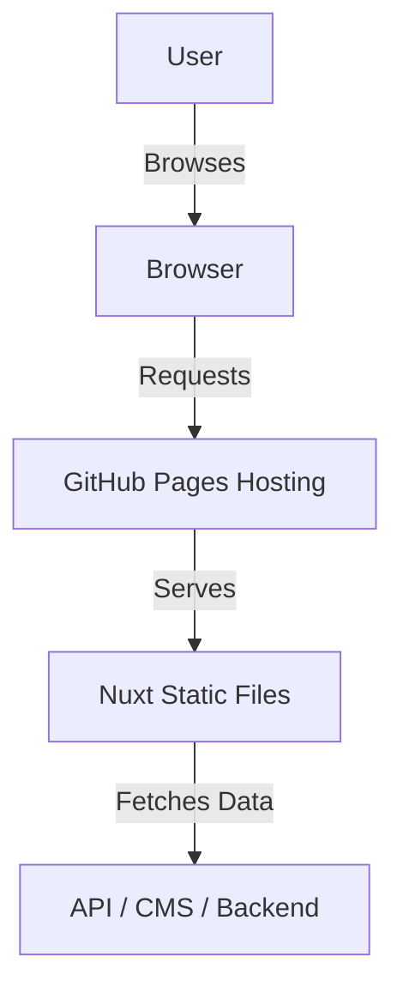

# Welcome to YOGAMOS

YOGAMOS is a modern web application built with Nuxt.js, designed to provide a seamless development experience with powerful tools and features.

**Website URL:** [www.yogamos.es](https://www.yogamos.es)


## Features

- **Nuxt 3**: Leverage the power of the latest Nuxt framework for server-side rendering and static site generation.
- **Nuxt UI Pro**: Build beautiful and responsive user interfaces with premium NuxtUI components.
- **Nuxt Content**: Manage your content with ease using the Nuxt Content module.
- **SEO & Performance**: Integrated with `@nuxtjs/seo`, `@nuxtjs/robots`, and `@nuxtjs/sitemap` for improved search engine visibility.
- **Internationalization**: Powered by `@nuxtjs/i18n` for multilingual support.
- **Optimized Images**: Uses `@nuxt/image` and `nuxt-og-image` for optimized media handling.
- **Vitest & Playwright**: Write and run fast, reliable tests for your application.
- **GitHub Pages Deployment**: Seamlessly deploy your application to GitHub Pages with a structured CI/CD pipeline.

Look at the [Nuxt documentation](https://nuxt.com/docs/getting-started/introduction) to learn more.

## Setup

Make sure to install dependencies:

```bash
# yarn
yarn install --immutable
```

## Development Server

Start the development server on `http://localhost:3000`:

```bash
# yarn
yarn dev
```

## Production

Build the application for production:

```bash
yarn build
```

Locally preview the production build:

```bash
yarn preview
```

Check out the [deployment documentation](https://nuxt.com/docs/getting-started/deployment) for more information.

---

## Deployment Process



### GitHub Actions CI/CD Workflow

Our deployment process uses **GitHub Actions** to automate builds and deployments to GitHub Pages.

#### Workflow Breakdown:

1. **Trigger:** The workflow runs on every push to the `main` branch.
2. **Setup:** Installs Node.js, sets environment variables, and installs dependencies.
3. **Build & Generate:** Runs `yarn generate` to generate static files.
4. **Deploy:** Pushes the generated files to the `gh-pages` branch.

#### Workflow YAML (Simplified Version):

```yaml
name: Build and Deploy to GitHub Pages

on:
  push:
    branches:
      - main

jobs:
  build:
    runs-on: ubuntu-latest
    steps:
      - name: Checkout repository
        uses: actions/checkout@v4

      - name: Setup Node.js
        uses: actions/setup-node@v4
        with:
          node-version: 20
          cache: 'yarn'

      - name: Install dependencies
        run: yarn install --immutable

      - name: Generate static site
        run: yarn generate

      - name: Deploy to GitHub Pages
        uses: JamesIves/github-pages-deploy-action@v4
        with:
          branch: gh-pages
          folder: .output/public
```

---

## Architecture Overview



- **User**: The end-user accessing the website.
- **Browser**: Loads the static content from GitHub Pages.
- **GitHub Pages**: Hosts and serves the pre-built static Nuxt application.
- **Nuxt Static Files**: The output generated by Nuxt’s static site generation (`yarn generate`).
- **API / CMS / Backend**: External services for dynamic data fetching.

---

## Translation & SEO Configuration

YOGAMOS uses **@nuxtjs/i18n** to provide a seamless multilingual experience. Content is organized into language-specific folders (`content/en/`, `content/es/`, `content/fr/`), allowing users to access pages in their preferred language.

### SEO & Sitemap Configuration

We enhance discoverability with:

- `@nuxtjs/robots`: Ensures proper indexing and search engine rules.
- `@nuxtjs/sitemap`: Generates a dynamic sitemap for improved SEO.
- `@nuxtjs/seo`: Provides meta tags and OpenGraph integration.

---

## Testing

### Running Tests

Make sure you have installed Vitest:

```bash
yarn install -D vitest @vue/test-utils jsdom
```

Run tests using:

```bash
yarn test        # Run all tests
yarn test:watch  # Run tests in watch mode
yarn test:ui     # Open Vitest UI
```

### Testing Overview

- **Unit Tests**: Ensures components function correctly.
- **Integration Tests**: Validates interactions between components.
- **SEO Tests**: Checks meta tags.
- **Error Handling**: Ensures proper error responses.

---

## Development Tools

### Nuxt Dev Tools

Nuxt DevTools is enabled by default in Nuxt v3.8.0. Open it using **Shift + Alt / ⇧ Shift + ⌥ Option + D** in your app.

### ESLint Inspector

```bash
npx @eslint/config-inspector@latest
```

Visit `http://localhost:7777/` to visualize your ESLint configuration.

---


